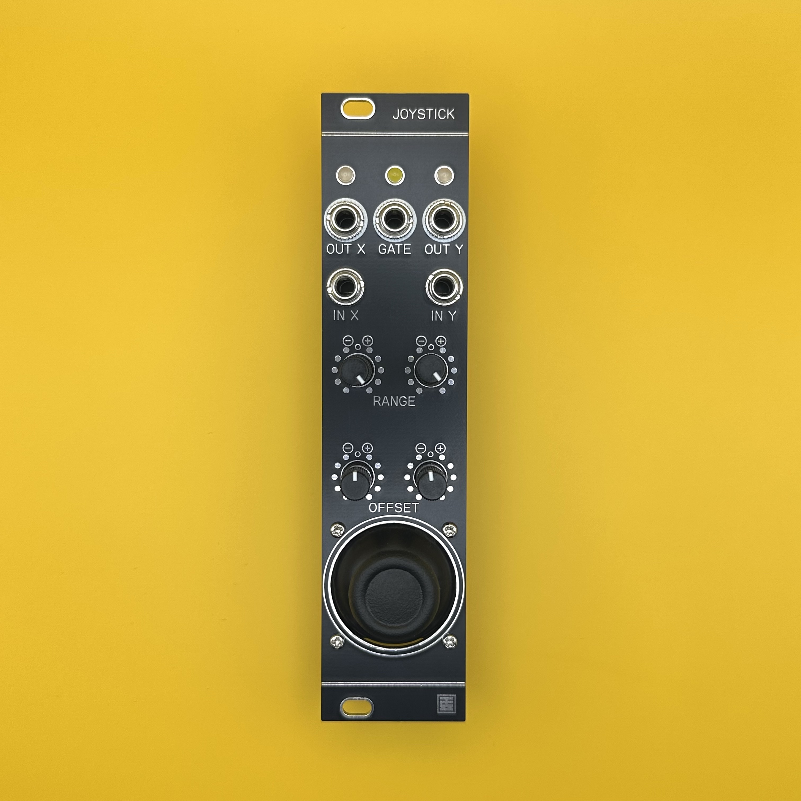
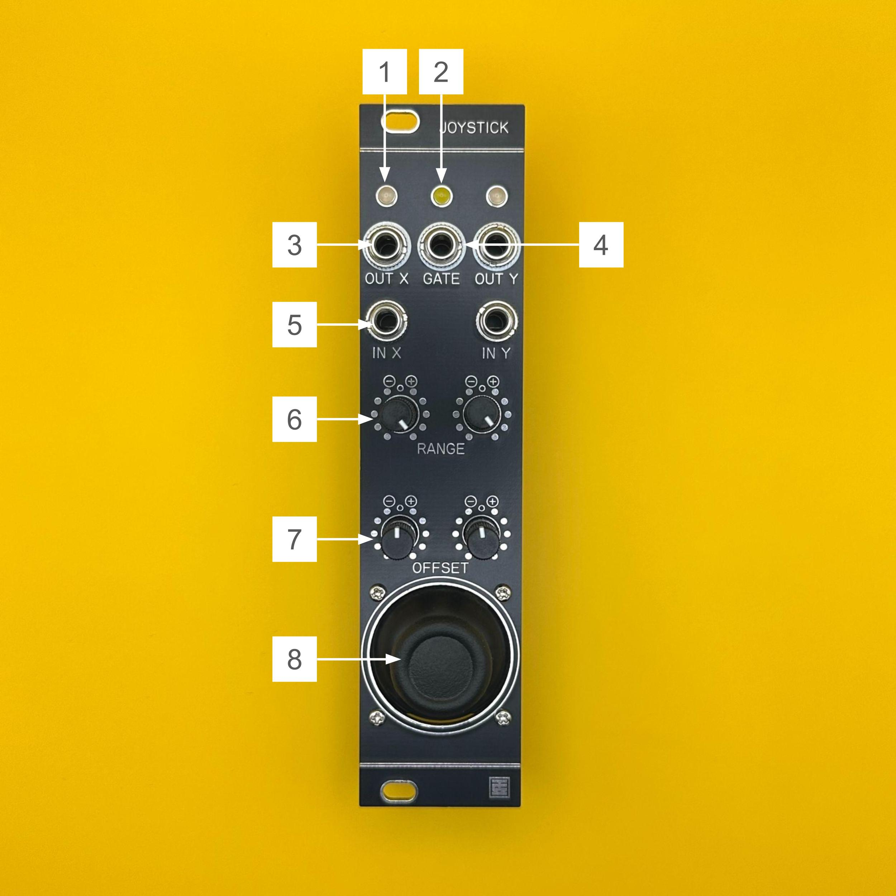

# Joystick マニュアル（日本語）

## 概要

**Joystick** は、6HPサイズの片手操作に特化したマニュアルCV／Gate生成モジュールです。  
XY入力端子に外部CVを接続することで、アッテネーターやインバーターとしても使用可能です。  
CVレンジおよびオフセットはX軸・Y軸ごとに個別に調整可能で、最大±10Vの範囲で任意のCVを生成できます。  
スティックを押し込むと、+10VのGate信号が出力されます。

---

## 仕様

- **フォーマット**：Eurorack  
- **幅**：6 HP  
- **奥行き**：25 mm  
- **消費電流**：+12V: 25mA / -12V: 25mA  

> ※ ケーブルの赤いラインが -12V に接続されるようにしてください。  
> 誤って接続するとモジュールが故障する恐れがあります。  
> **電源投入前に必ずケーブルの向きを確認してください。**

---

## 各部の機能

1. **LED (X/Y)**  
   CV出力信号の振幅と極性を表示します。  
   プラス出力時は緑、マイナス出力時は赤に点灯します。

2. **LED (GATE)**  
   GATE信号のON／OFFを表示します。  
   HIGHで黄点灯、LOWで消灯します。

3. **OUT X/Y**  
   XまたはY軸方向のCV出力端子です。  
   出力範囲は最大±10Vです。

4. **GATE**  
   ジョイスティックを押し込んでいる間、+10VのGATE信号を出力します。

5. **IN X/Y**  
   デフォルトでは内部で+10Vが供給されています。  
   外部CVを接続すると内部電圧は遮断され、ジョイスティックはそのCV信号に対するアッテヌバーターとして動作します。

6. **RANGE**  
   IN端子および内部+10Vに対するアッテヌバーターです。  
   左端で-1倍、中央で0V、右端で+1倍となります。

7. **OFFSET**  
   CV出力に加える直流オフセット電圧を調整します。  
   左端で-10V、中央で0V、右端で+10Vになります。

8. **JOYSTICK**  
   X／Y方向および押し込み（Z）に対応したジョイスティックです。  
   指を離すと自動的にセンターへ戻ります。

---

> ジョイスティックを最大まで倒すと、センターに戻らないことがあります（仕様）。  
> アナログ回路の特性上、スティックのセンター位置でCV出力が正確に0Vとならないことがあります。  
> 必要に応じて**OFFSETノブ**で微調整してください。

---

## ライセンス

この作品は [Creative Commons 表示 - 継承 4.0 国際 (CC BY-SA 4.0)](https://creativecommons.org/licenses/by-sa/4.0/deed.ja) の下でライセンスされています。

---

## クレジット

- **Designed by**：StudioKAT  
- **Website**：[https://www.studiokat.jp/](https://www.studiokat.jp/)  
- **GitHub**：[https://github.com/StudioKAT](https://github.com/StudioKAT)  
- **X（旧Twitter）**：[https://x.com/StudioKAT_synth](https://x.com/StudioKAT_synth)  
- **Instagram**：[https://www.instagram.com/studiokat_modular/](https://www.instagram.com/studiokat_modular/)

---

## 更新履歴

- `2024-09-28`：v1.0（基板設計ミスにより未リリース）  
- `2025-04-24`：v2.0 リリース  
