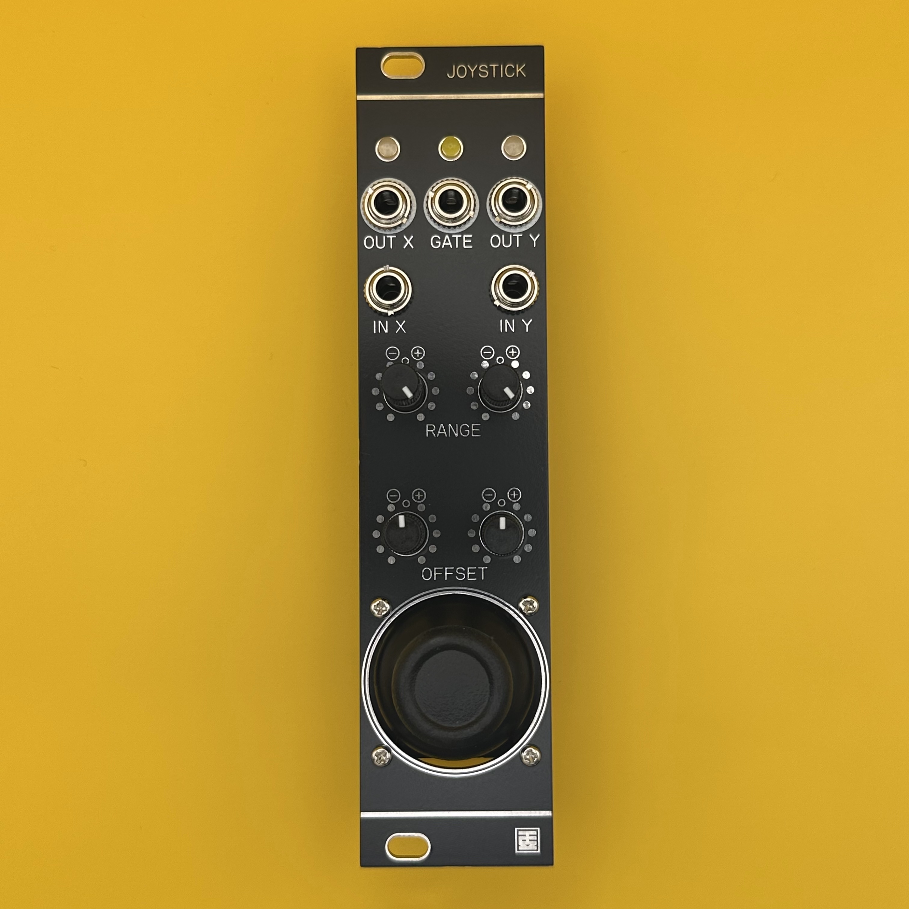

# Joystick

## 概要 / Overview

**Joystick** は、6HPサイズの片手操作に特化したマニュアルCV/Gate生成モジュールです。  
XY入力端子に外部CVを接続することで、アッテネーターやインバーターとしても利用可能です。  
CVレンジとオフセットはX軸・Y軸ごとに個別に調整でき、最大±10Vの範囲で任意のCVを生成できます。  
スティックを押し込むと、+10VのGate信号が出力されます。

**Joystick** is a 6HP manual CV/Gate generator module designed for one-handed operation.  
By connecting external CV signals to the X and Y inputs, it can also function as an attenuator or inverter.  
Each axis (X and Y) features independent control over CV range and offset, allowing for custom voltage outputs up to ±10V.  
Pressing the joystick down outputs a +10V Gate signal.

## 仕様 / Spec
- Format: Eurorack
- Function: Attenuator-Inverter joystick controller and Gate Generator.
- Current needs: +12V: 35mA, -12V: 35mA
- Width: 6 HP
- Depth: 25mm (including power connector)

## 動画 / Movie

## 販売 / Sales

StudioKATオフィシャルショップで販売しています。(日本国内限定)  
https://www.studiokat.jp/items/106541452

## ライセンス / License

この作品は [Creative Commons 表示 - 継承 4.0 国際 (CC BY-SA 4.0)](https://creativecommons.org/licenses/by-sa/4.0/deed.ja) の下でライセンスされています。  
This work is licensed under the [Creative Commons Attribution-ShareAlike 4.0 International License](https://creativecommons.org/licenses/by-sa/4.0/).

## クレジット / Credits

- Designed by : StudioKAT
- Website : https://www.studiokat.jp/
- GitHub : https://github.com/StudioKAT
- X(Twitter) : https://x.com/StudioKAT_synth
- Instagram : https://www.instagram.com/studiokat_modular/

## 更新履歴 / Changelog

- `2024-09-28` v1.0 Unreleased
- `2025-04-24` v2.0 Released
- `2025-07-02` v3.0 Released