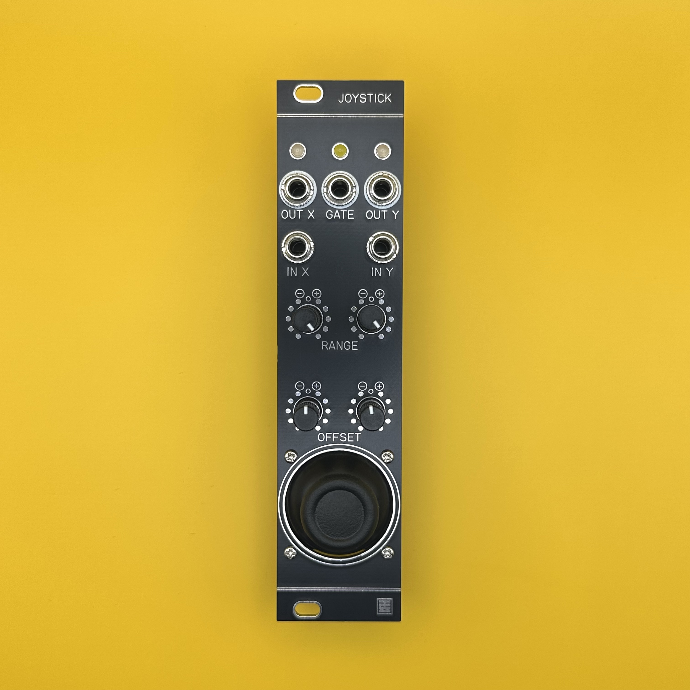

# Joystick Manual (English)

## Overview

**Joystick** is a 6HP module designed for one-handed manual control of CV and Gate signals.  
By patching external CV into the XY inputs, it can also function as an attenuverter or inverter.  
The CV range and offset are independently adjustable for each axis (X/Y), allowing output up to ±10V.  
Pushing the joystick down generates a +10V Gate signal.

---

## Specifications

- **Format**: Eurorack  
- **Width**: 6 HP  
- **Depth**: 25 mm  
- **Current Draw**: +12V: 35mA / -12V: 35mA  

> **IMPORTANT**: Make sure the red stripe on the ribbon cable connects to -12V.  
> Incorrect installation may cause permanent damage to the module.  
> **Always verify cable orientation before powering on.**

---

## Features

1. **LED (X/Y)**  
   Indicates the amplitude and polarity of the CV output.  
   Green = positive voltage, Red = negative voltage.

2. **LED (GATE)**  
   Indicates Gate signal status.  
   Lit in yellow when HIGH, off when LOW.

3. **OUT X/Y**  
   CV output for the X or Y axis.  
   Output range: up to ±10V.

4. **GATE**  
   Outputs +10V while the joystick is pressed down.

5. **IN X/Y**  
   By default, internally normalized to +10V.  
   When an external CV is connected, internal voltage is bypassed, and the joystick acts as an attenuverter for the input signal.

6. **RANGE**  
   Attenuverter for the internal +10V or the input CV signal.  
   Full left: -1×, center: 0V, full right: +1×.

7. **OFFSET**  
   Adds a DC offset to the CV output.  
   Range: -10V (left), 0V (center), +10V (right).

8. **JOYSTICK**  
   Supports motion on the X/Y axes and push (Z).  
   Returns to center position when released.

---

> When the joystick is pushed fully in one direction, it may not return to center automatically (this is intentional).  
> Due to analog circuit characteristics, the CV output may not be exactly 0V when the stick is centered.  
> Use the **OFFSET knob** to fine-tune as needed.

---

## License

This work is licensed under a [Creative Commons Attribution-ShareAlike 4.0 International License (CC BY-SA 4.0)](https://creativecommons.org/licenses/by-sa/4.0/).

---

## Credits

- **Designed by**: StudioKAT  
- **Website**: [https://www.studiokat.jp/](https://www.studiokat.jp/)  
- **GitHub**: [https://github.com/StudioKAT](https://github.com/StudioKAT)  
- **X (Twitter)**: [https://x.com/StudioKAT_synth](https://x.com/StudioKAT_synth)  
- **Instagram**: [https://www.instagram.com/studiokat_modular/](https://www.instagram.com/studiokat_modular/)

---

## Changelog

- `2024-09-28`: v1.0 (Not released due to PCB design issue)  
- `2025-04-24`: v2.0 Released  
